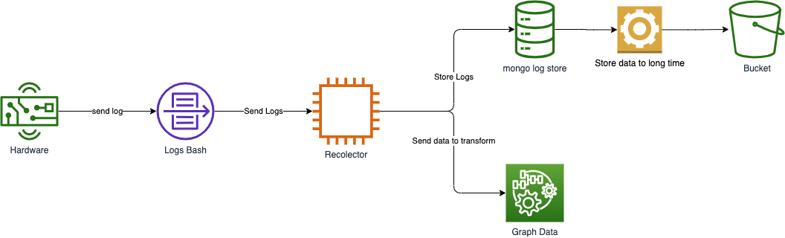

# Flujo de Logs

Este tema te introduce a los distintos caminos a los cuales son procesados los logs del recolector de ruido. desde el cómo se envían los datos al recolector y cómo son procesados para luego ser medidos.

## Principales conceptos

A continuación se presenta un diagrama que muestra la comunicación entre los distintos componentes claves.

Esta arquitectura esta pensada para soportar
